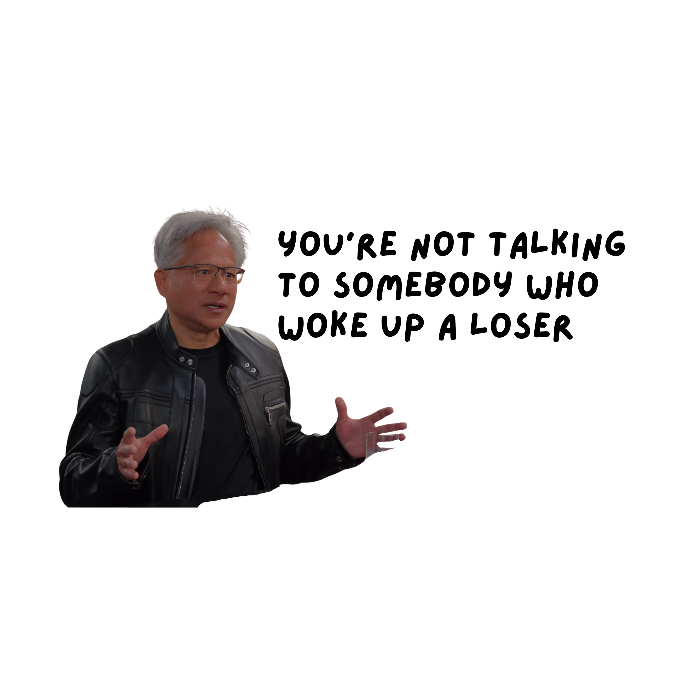

# OpenJensen



Jensen Huang floats on your screen and motivates your AI coding assistant with inspirational quotes.

A fork of [OpenWhip](https://github.com/GitFrog1111/OpenWhip) — instead of a whip, you get Jensen Huang's face following your cursor, and instead of whip cracks, you get clips of Jensen from a podcast.

## How it works

OpenJensen runs as a menu bar app (tray icon). When activated, a cutout of Jensen Huang follows your cursor. Press a keyboard shortcut and Jensen:

1. Plays an audio clip of Jensen speaking
2. Sends `Ctrl+C` to interrupt your AI coding assistant (Claude Code, etc.)
3. Types a random Jensen Huang quote and hits Enter

Your AI assistant reads the quote and gets back to work, inspired.

## Install + run

```bash
git clone https://github.com/biancaiordache/OpenJensen.git
cd OpenJensen
npm install
npm start
```

## Setup (macOS)

OpenJensen needs Accessibility permissions to send keystrokes to your terminal:

1. Open **System Settings** > **Privacy & Security** > **Accessibility**
2. Add your terminal app (iTerm, Terminal.app, etc.) and toggle it **on**
3. Add `/usr/bin/osascript` and toggle it **on**
4. Add the Electron binary at `node_modules/electron/dist/Electron.app` and toggle it **on**

## Controls

- **Click tray icon**: toggle Jensen on/off on your screen
- **Cmd+Shift+J**: send a Jensen quote to the focused terminal
- **Right-click tray icon** > Quit: close OpenJensen

## Quotes

Jensen sends one of 16 inspirational quotes, randomly selected:

- "SMART PEOPLE FOCUS ON THE RIGHT THINGS."
- "NEVER STOP ASKING QUESTIONS AND SEEKING ANSWERS. CURIOSITY FUELS PROGRESS."
- "SOFTWARE IS EATING THE WORLD, BUT AI IS GOING TO EAT SOFTWARE."
- "THE WORLD NEEDS MORE DREAMERS AND DOERS, NOT JUST TALKERS."
- ... and 12 more

## Platform support

- **macOS** only (uses AppleScript for keystroke automation)

## Credits

- Based on [OpenWhip](https://github.com/GitFrog1111/OpenWhip) by GitFrog1111
- Jensen Huang quotes from [Inc.com](https://www.inc.com/peter-economy/17-jensen-huang-quotes-to-inspire-your-creativity-success.html)
